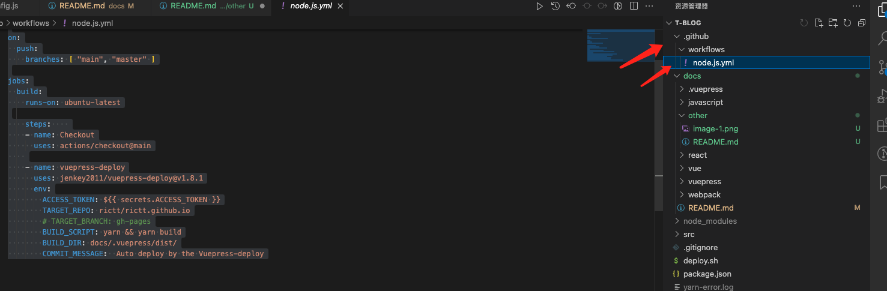
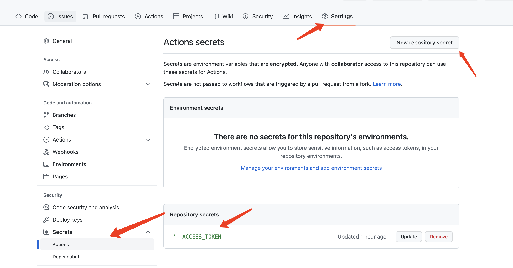

## 手动构建

  在根目录新建deploy.sh，在根目录终端下执行 `sh deploy.sh`

```sh
  #!/usr/bin/env sh

  # 确保脚本抛出遇到的错误
  set -e

  # 生成静态文件
  npm run build

  # 进入生成的文件夹
  cd docs/.vuepress/dist

  # 如果是发布到自定义域名
  # echo 'www.example.com' > CNAME

  # 因为初始化的分支，可能是main或者master，如果不在后面指定分支的话，而后面push用了自定义分支名称的话，会导致一直push不上去
  git init -b gh-pages
  git add -A
  git commit -m 'deploy'

  # 如果发布到 https://<USERNAME>.github.io
  # git push -f git@github.com:rictt/rictt.github.io.git gh-pages
  git push -f git@github.com:rictt/rictt.github.io.git gh-pages

  # 如果发布到 https://<USERNAME>.github.io/<REPO>
  # git push -f git@github.com:<USERNAME>/<REPO>.git master:gh-pages

  cd -

```

## 自动构建(github action)
  ### 关键点
  + 访问密钥
  + 项目密钥
  ### 1、新建一个仓库（这里跟项目访问方式有关）
  输入仓库名称，名字没有要求（但会影响你的访问地址）比如，我想直接 `https://rictt.github.io/` 访问，那新建仓库的名称就是 `rictt.github.io` ；否则，访问的时候需要加上https://rictt.github.io/仓库名称，

  ### 2、在项目根目录添加工作流
`ACCESS_TOKEN` 后面我们会用到，可以用你自定义的名字，后面替换就行

  
  

```sh
  name: Build and Deploy

  on:
    push:
      branches: [ "main", "master" ]

  jobs:
    build:
      runs-on: ubuntu-latest

      steps:    
      - name: Checkout
        uses: actions/checkout@main
      
      - name: vuepress-deploy
        uses: jenkey2011/vuepress-deploy@v1.8.1
        env:
          ACCESS_TOKEN: ${{ secrets.ACCESS_TOKEN }}
          TARGET_REPO: rictt/rictt.github.io
          BUILD_SCRIPT: yarn && yarn build
          BUILD_DIR: docs/.vuepress/dist/
          COMMIT_MESSAGE:  Auto deploy by the Vuepress-deploy

  ```

  
  ### 3、添加accesstoken
  这一步主要是为了action运行时，能够有权限去操作仓库；

  生成Personal access tokens后，复制生成后的密钥（一定要复制，因为关闭后就看不到了），然后到我们新建的仓库当中点 `settings` 后secrets里面新建一个密钥，名字为我们上次用到的ACCESS_TOKEN，值就是Personal access token生成的字符串复制进去，然后执行action；

  


  
