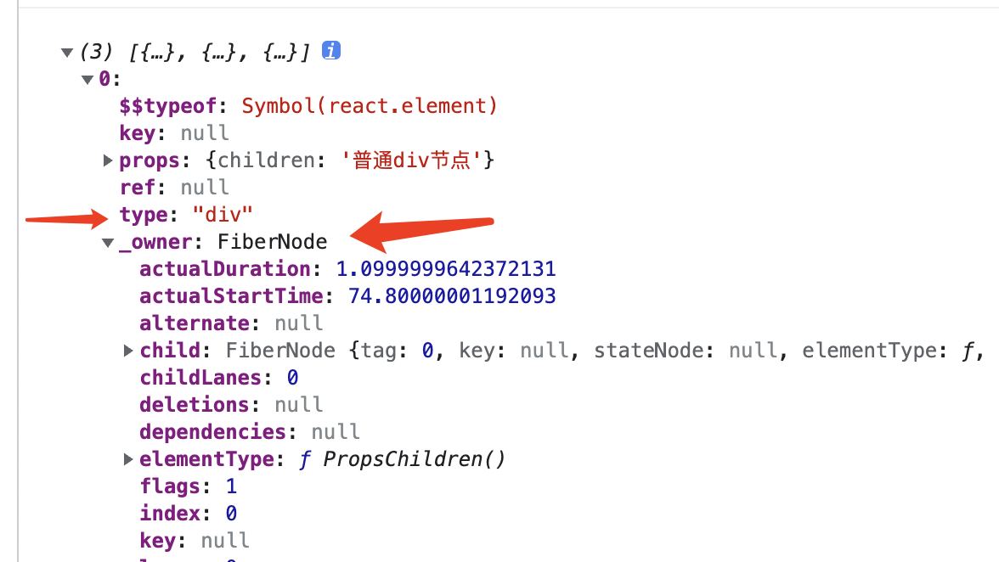

  ## 什么是Fiber

  Fiber是React团队用来描述dom节点以及vnode节点的数据结构层，可以理解为两者的桥梁；

  从数据结构上，Fiber是对节点新的描述结构；

  我们都知道我们写的jsx最终都会经过babel编译，转换成React.CreateElement最后变成ReactElement，该ele保存了jsx对应的信息，并且创建一个FiberNode绑定上；如下

  

  为什么需要这个桥梁，首先分层可以将工作的粒度分小，并且分工明确；React依赖这三层去做节点更新；哪三层呢

  - reactelement节点层（vnode层）
  - fiber节点层
  - dom节点层

  如果把对应层的工具具体一点说，可以想象如下

  - setState({ a: 123 })
  - 找到setState的组件fiber节点，从该节点开始遍历子节点兄弟节点，找到需要更新的fiber
  - 更新fiber对应的dom节点

  从更新协调上，Fiber是对节点更新新的协调算法；（下文说）

  从计算机操作系统上，Fiber对应纤维；操作系统上进程是最小可分配的单元，线程是最小可调度的单元，而Fiber是更小的一个单元，在react当中，fiber实际上作为每次任务的执行最小工作，也是贴切的叫法；

  **小结：什么是Fiber，Fiber可以理解为 = Fiber数据结构 + Fiber协调算法；**

  ---

## 为什么提出了Fiber，都做了些什么

  ### Stack Reconcilation（基于栈的协调算法）

  首先react16之前的架构主要是基于栈结构去更新渲染的，16之后才是Fiber；我们都知道html结构是天然的嵌套结构，很适合用栈来进行管理；基于此16之前的架构也是用栈来进行保存节点，然后更新；有特点，实现简单；但同样也导致了其他问题

  **首先是特点**
  - 数据结构简单（栈结构保存）
  - 协调算法简单（栈递归就完事了）
  - 同步、递归执行/更新

  **缺点**

  - 节点层次太深，每次更新一个state，都要从根节点去递归找到需要更新的节点（内存占用高，层次深）
  - 堵塞渲染进程，js进程和浏览器渲染进程是互斥的，同时只能存在一个
    - 这也就导致了不能够让出主线程，等待下一次执行（保存更新节点信息代价大）；

      栈结构的问题，每个栈元素只能够访问到当前及children的信息；由于我们的遍历算法是DFS，当需要暂停的时候，要想恢复我们需要保存父亲节点以及其他兄弟节点；当节点够多时，内存占用消耗极大

  ### Fiber Reconcilation（Fiber协调算法）

  针对上面的缺点，堵塞主线程 + 不支持暂停等缺点；React团队提出了新的架构

  首先是新的数据结构Fiber，用链表来保存每个节点信息，分别通过`return`、`sibling`、`child`来执行兄弟姐妹父亲；

  - return指向父亲节点
  - sibling指向兄弟节点
  - child指向`第一个`子节点

  其次是协调算法，类似DFS（深度搜索优先），执行完当前Fiber节点比较

  - 1、执行完当前Fiber节点比较
  - 2、执行child节点比较
    - 2.1、如果有child节点，重复顺序1
    - 2.2、如果没有child节点，返回找兄弟节点
  - 3、执行兄弟节点
    - 3.1、如果有，重复顺序1
    - 3.2、如果没有，返回父亲节点

  **新架构优点**
  - 异步更新（不堵塞主线程，可以根据情况所有权）
  - 可以暂停恢复

  #### 为什么可以异步更新
  首先你知道显示器帧率/赫兹吧，一般都是60，也有120；代表什么意思呢：显示器一秒钟绘制60/120次，也就是每16毫秒进行绘制内容（1000/60）；

  浏览器也是一样，浏览器绘制顺序包括
  - xxxx
  - js执行
  - style绘制
  - layout生成
  - paint绘制
  - 合成

  也就是说16ms我们要完成上面这么多的事情；如果我们的更新任务太多时间太长，就会占据js执行的很大部分时间，从而影响用户体验（卡顿）；

  所以react内部设置了每次调度的执行时间（大概5ms），超过这个时间就停止执行任务；等待下一次的循环再执行任务（基于MessageChannel）；

  所以我们说是异步的

  #### 为什么这种协调算法就能实现暂停

  首先当我们有高优先级的任务或者协调算法执行瞬间不够的时候，我们将当前Fiber节点保存起来（占用一个内存）；当有新的执行时间可以执行任务时，找到这个节点，通过`return`、`sibling`、`child`就实现了恢复（代价比较低）

