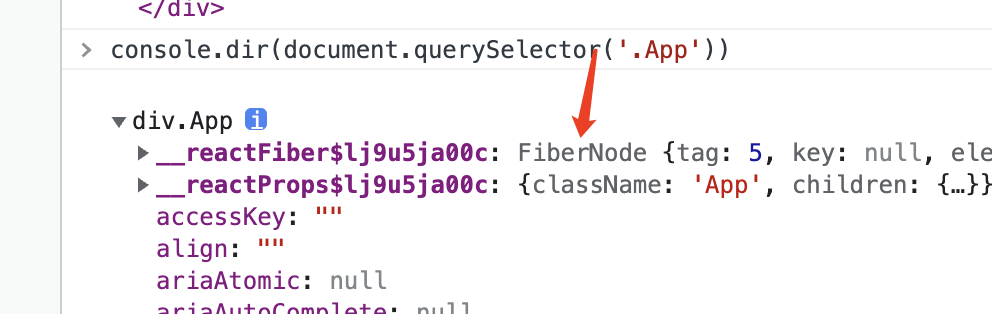

## 几个问题
  - 什么是事件合成
  - 如何模拟事件捕获和事件冒泡
  - 如何找到事件源对象，并且往上冒泡捕获呢
  - 一次点击到事件执行大概经过了什么？

---

## 为什么有事件系统
  不同的浏览器有不同事件，并且事件处理机制还不一样；React为了兼容事件系统在多平台表现一致，抹平差异；所以React自己实现了一套事件系统，事件捕获，事件源对象，冒泡等等；

--- 

## 什么是事件合成
  
  `React的事件`可能不是由单一事件组件，比如onClick是click事件，onChange则是`input、change、focus`等多个事件合成，所以叫事件合成。为什么这么做的，我觉得还是为了磨平差异吧？浏览器表现不同

  当你在一个dom上绑定了onClick事件，会在document上绑定click事件；绑定onChange，会在document绑定change、input等事件；（后面说为什么）

  所以你如果打开浏览器看dom节点上的事件的话，有可能看不到你绑定的事件
  
---

## 如何找到事件源对象，并且往上冒泡捕获呢

  由于我们在document上绑定了各种事件，当事件触发的时候，最终会到document的回调函数中，在回调参数event中，我们可以获取的真正的事件触发源：`target || srcElement`，通过dom节点上绑定的fiber关系，初始化一个事件队列栈，从当前fiber往上遍历，遇到onXXX的事件，将该函数push到队列尾部；如果是onXXXCapture的捕获事件，则将该函数unshift到队列头部；

  fiber遍历完成后，从头到尾逐个执行回调函数；由于我们的捕获事件是按顺序推到头部，所以也就模拟了捕获以及冒泡事件；
  
  ---

  **当然这个模拟并不完美**

  我们提到，我们是通过fiber对象上看到有没有props对应到onXX属性，来进行事件回调收集，那如果是用户直接在dom上addEventListener的事件呢？这个时候我们会收集不到，脱离了React的控制；

  下面这个例子在react16.8.1中执行，可以看出我们手动addEventListener的事件，不管是冒泡还是捕获，顺序都是先于我们的react事件回调的，主要还是因为我们的冒泡捕获是模拟的；

  ```ts
  import React from "react";

  // 点击【冒泡执行】按钮的执行顺序会是
  // add event * 2
  // 冒泡执行
  // father click
  export class EventDemo extends React.PureComponent {
    componentDidMount() {
      const btn1 = this.refs.btn1;
      const handle = () => {
        console.log("add event");
      };
      // 冒泡执行
      btn1.addEventListener("click", handle, false);
      // 捕获执行
      btn1.addEventListener("click", handle, true);
    }

    render() {
      const onClick = () => {
        console.log("冒泡执行");
        console.log(this.refs.btn1);
      };
      const onClickCapture = () => {
        console.log("捕获执行");
      };
      const fatherClick = () => {
        console.log("father click");
      };

      return (
        <div onClick={fatherClick}>
          <button ref="btn1" onClick={onClick}>
            冒泡执行
          </button>
          <button onClickCapture={onClickCapture}>捕获执行</button>
        </div>
      );
    }
  }

```

## 一次点击到事件执行大概经过了什么？

  首先点击事件是冒泡到我们绑定的顶层容器document上，由于我们在处理props的时候，根据props进行了容器事件绑定；当document收到事件执行的时候，获取事件的真正触发源（通过event.target || srcElement)，比如是button，button上面会有一个引用指向对应的Fiber节点（如下）；接着通过该fiber节点，按照子节点->兄弟节点逐个遍历收集节点上的onXXX事件，保存到一个队列当中；最后模拟冒泡捕获，按顺序执行这个队列，最后结束

  **不负责任的小结**
  - 1、处理jsx上的onXXX事件，给顶层容器document绑定事件
  - 2、用户交互，事件触发
  - 3、document接收到事件触发，找到事件源
  - 4、获取事件源的fiber对象
  - 5、从当前fiber开始，收集事件回调
  - 6、执行队列中的事件
  - 7、结束

  


## React17的事件系统做了什么？

  ### 第一件事：顶层容器变更

  不再直接绑定到document上，由于微前端的不断应用，可能会有多个应用在一个页面上，这个时候再绑定到document上可能会有意想不到的结果；在react17版本可以，事件代理统一改成用户`render的root节点上，也就是在app.js中挂载的节点`；

  ### 第二件事：保证捕获冒泡顺序

  这个版本react做了啥，挂载的时候会对root节点进行事件绑定（常见的八十多个浏览器事件），而且是绑定两次，捕获一次，冒泡一次；

  这个事件当事件触发，会执行一次dispatch，从事件源触发，收集所有的捕获事件，接着再执行第二次dispatch，从事件源触发，收集所有的冒泡事件

  保证捕获冒泡的先后顺序（用户自己监听的也是如此，按dispatch的先后顺序就知道了，先执行捕获再执行冒泡的）

  **小结：** 和旧版本的区别，事件的执行会执行两次dispatch