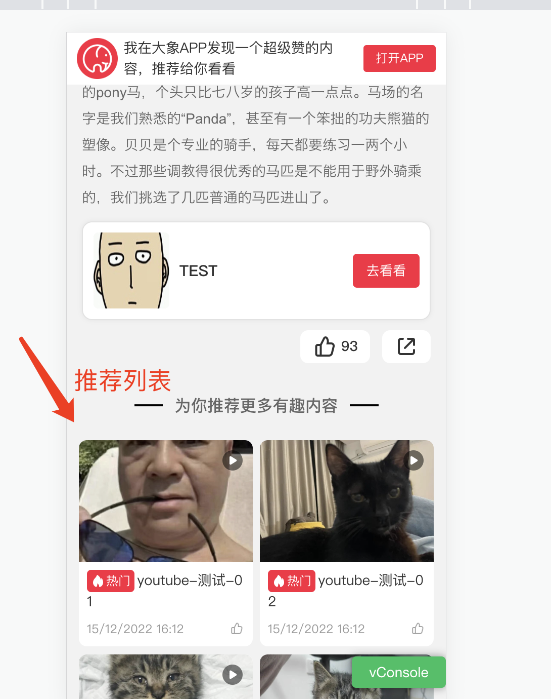

## 背景

  h5项目是一个多页下的单页结构，可以想象每一个营销h5页面是一个多页面；这是大背景，因为架构结构比较复杂，改造起来都比较麻烦（前提）

  
  

## 现况

  **1、在某一期的迭代中，发现页加入了推荐列表从当前路由跳转到发现页详情（同一个页面，不同详情）**

  解决方案：
  - location地址reload
  - 将详情页面封装成一个组件，然后新增一个路由，指向这个组件；（两个路由相互跳转）

  **2、又某一天，产品又提了一个需求说：怎么返回的时候不能记录滚动位置啊，这体验很不好**

  于是又进行第二波改造，要记录返回的滚动位置，那就是要缓存组件，然后手动设置滚动位置

  **解决方案**
  - keep-alive缓存组件 + 栈管理滚动距离

  **详细**：每次进入详情页，将当前id以及滚动距离推到栈中；退出/返回的时候拿出栈顶顶对象，进行滚动距离设置

  **方案缺陷**：虽然可以解决返回滚动的问题，但由于我们keep-alive缓存的组件其实只有两次，第三次的时候其实是缓存组件了，需要在activated加入判断逻辑id是不是变了，获取新的数据，这就导致中间会有一个显示旧数据的问题（这个也好说，加工loading）

  到这个阶段，这个页面结构已经残破不堪了；
  
## 改造方案

  改造keep-alive，如果是我们的发现页，将id作为一个key，缓存对应的组件实例

  **效果**

  可以移除多余的栈队列，不需要丢到栈里维护滚动行为了；每个组件只需要记录自己的滚动行为，activated的时候滚动到对应位置，同时每个组件实例可以缓存反复使用；

  ```js
  // 部分代码如下
  this.$on('discovery:mounted', (compInstance) => {
    // 由业务组件进行手动触发，加入缓存cache中
    const { $vnode } = compInstance
    const { cache, $route } = this
    if ($route.query && $route.query.id) {
      const cacheId = $route.query.id
      if (!cache[cacheId]) {
        this.keys.push(cacheId)
        this.cache[cacheId] = $vnode
      }
    }
  })

  if (cache[key]) {
    // 我们的业务组件名称
    if (['Detail', 'DetailRedirect'].includes(name)) {
      // const cacheId = cache[key].componentInstance.cacheId
      const cacheId = this.$route.query && this.$route.query.id
      if (cache[cacheId]) {
        console.log('命中缓存，返回缓存')
        console.log("cacheId: ", cacheId)
        vnode.componentInstance = cache[cacheId].componentInstance
      } else {
        cache[cacheId] = vnode
        keys.push(cacheId)
      }
    } else {
      vnode.componentInstance = cache[key].componentInstance
    }
  } else {
    cache[key] = vnode
    keys.push(key)
  }
  ```


## 小结

  其实不管是什么方案，都挺复杂的。。。最后是从设计上解决这个问题，上述方案不管是改造成本还是新功能迭代，都有不小的风险；