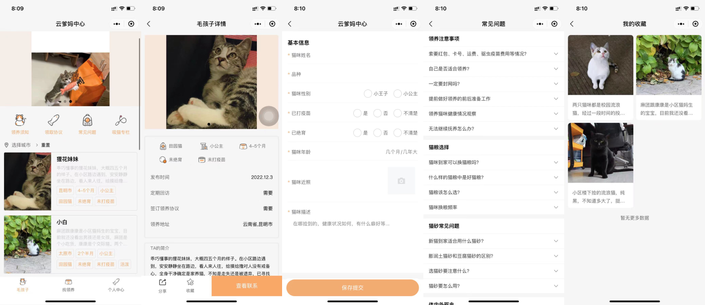

## 介绍

  欢迎扫码体验，这是一个猫咪领养小程序。主要功能是：通过用户在线填写猫咪信息，其他用户通过搜索查找到心仪的猫咪，完善个人领养信息后，进行猫咪领养，领养前需要先查看是否符合领养要求，比如是否同城，已封窗等等；确认无误后，进行申请，确认无误后可以获得相关联系方式；
## 业务逻辑

  - [墨刀原型](https://modao.cc/app/design/pbl9nu883xcydvw0)
  - [项目地址](https://github.com/rictt/cat-adoption)

## 项目展示
  
  
### 模块一：首页
- 进来首页，首先根据用户定位的城市，优先展示所在城市的领养列表，如果数据为空，则默认展示全国；
- 用户可以自定义筛选城市，获取不同的领养列表
- 从领养列表进去详情页，展示领养的详情，包括基本信息，领养要求，领养合约等等
- 用户需要点击申请按钮，出现弹窗，请确认是否满足xxx，再二次确认申请
  - 申请后，产生一条申请记录，落库
  - 展示对方的微信号，联系方式等
  - 问题：如何确认该条领养已经结束等？由谁来追踪，反馈
    - 在第一条申请的七天后，自动关闭领养状态
    - 或者由运营接受到反馈，主动关闭领养状态
- 获取到领养信息后，由双方沟通约定线下领养啥吧啦啦啦的
### 模块二：关于我的
- 个人基本信息展示、完善（修改定位，领养意向等等）
- 领养记录
- 领养常识菜单展示

### 模块三：我要领养/找领养
- 暂时只考虑我要找领养模块（考虑到流浪小动物比较多）
- 填写流浪动物的基本信息，位置，在哪遇到，领养要求等
- 发布后自动进入领养列表（用不用审核？前期应该只有运营会填）
